### Takeaways

#### Mujoco
* World model of the 2R manipulator arm in front of a sketching board/ wall
* Need to enable contact forces between manipulator and the board
* Need to add sensors to end affector to measure our controller quantities

#### Force controller
* Desired quantities to control in the end affector space can be mapped to force vectors which are then mapped to joint space to achieve the desired control
* Sometimes its not easy to map quantites to control to the control space
* Not robust to external disturbance
* Needs hand tuning of controller behaviour like oscillations and steady state error
* Torques applied can be really large as seen in the graphs and need capping potentially unbounded based on the error

|    Ef force     |      Ef velocity    |   Ef pose     |    Joint torques     |
| ----------------------------------------------------------------------------------------------------------------------------------------------------------- | ---------------------------------------------------------------------------------------------------------------------------------------------------------- | ---------------------------------------------------------------------------------------------------------------------------------------------------------- | ---------------------------------------------------------------------------------------------------------------------------------------------------------- | 
| 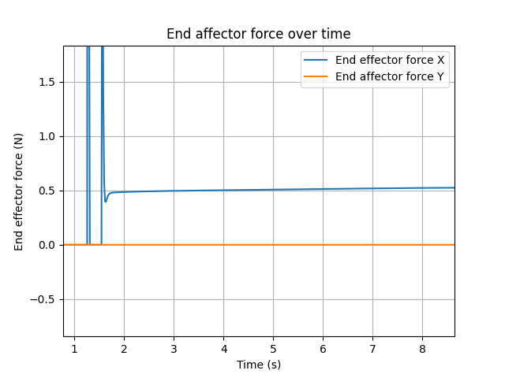 | 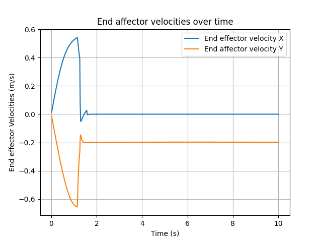 | 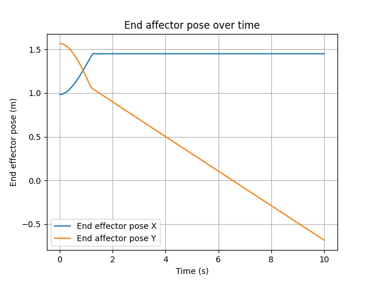 |  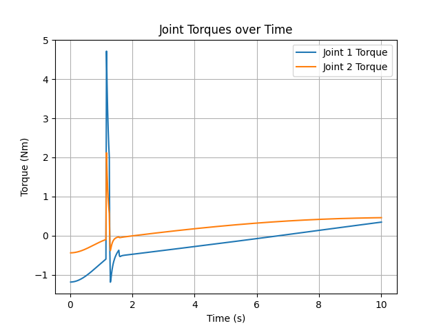 |

#### State space control (state: q,qdot)
* Necessary condition is the dynamic equation of the system, for an N-link manipulator lagrangian energy method is a good way to derive this, math can get complicated
* A non linear system like the manipulator needs to be linearised about an operating point to apply the state space control theory
* Linearisation can be achieved using taylor series expansion and also numerical perturbation, in practice numerical perturbation is way easier to implement and the result is identical from both the methods
* End affector force cannot be modelled in the dynamic equation of the manipulator since the dynamic equations is used to get an optimal feedback gain K and then all that the controller sees is the desired state and actual state, the modelled force in the dynamics is hidden away by K, so modelling that force in the dynamics of the manipulator might get you a better K but thats it
* End affector force needs a feedforward term in the control law along with the state space tracking feedback term
* Does not need hand tuning of the controller behaviour, more robust to external disturbance
* Good tracking of end affector force is not achieved because it is a feed forward term in my control law

|    Ef force     |      Ef velocity    |   Ef pose     |    Joint torques     |
| ----------------------------------------------------------------------------------------------------------------------------------------------------------- | ---------------------------------------------------------------------------------------------------------------------------------------------------------- | ---------------------------------------------------------------------------------------------------------------------------------------------------------- | ---------------------------------------------------------------------------------------------------------------------------------------------------------- | 
| 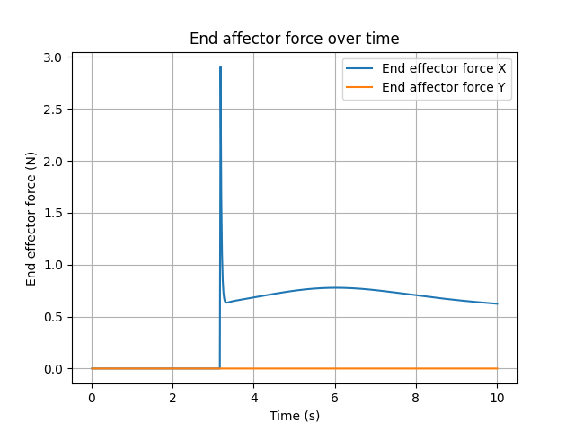 | 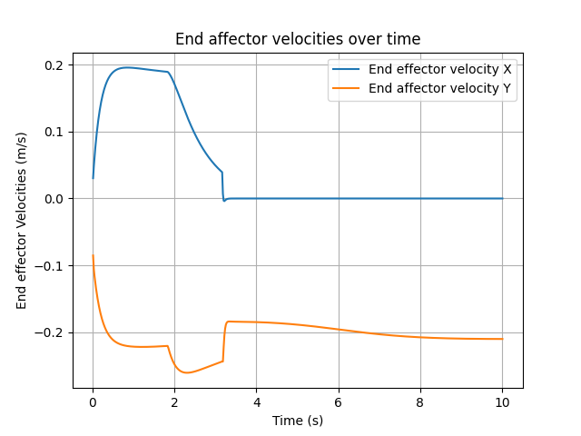 | 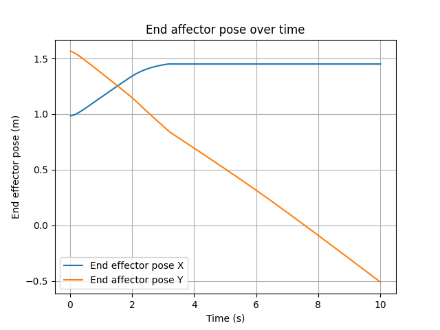 |  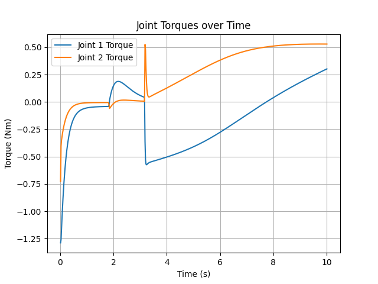 |

#### State space control (state: q,qdot,qddot)
* Our control space is torques applied to the joints of the manipulator which directly changes the acceleration of the joints
* The controller applies certain accelerations to track other desired quantities i.e. position/ velocity
* If our tracking controller also tries to control the acceleration then it loses the ability to track the other quantities
* So the lqr is unstable if we try to track all three acceleration along with velocity and position
* If the accleration weights in the Q matrix are decreased the controller becomes stable but does not track our desired acceleration

|    Ef force     |      Ef velocity    |   Ef pose     |    Joint torques     |
| ----------------------------------------------------------------------------------------------------------------------------------------------------------- | ---------------------------------------------------------------------------------------------------------------------------------------------------------- | ---------------------------------------------------------------------------------------------------------------------------------------------------------- | ---------------------------------------------------------------------------------------------------------------------------------------------------------- | 
| 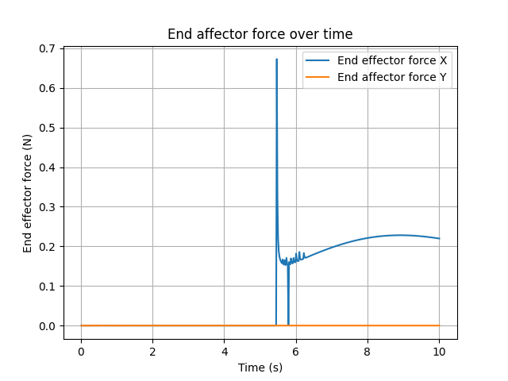 | 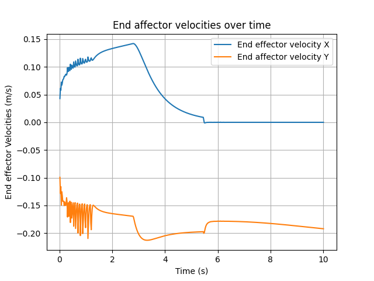 | 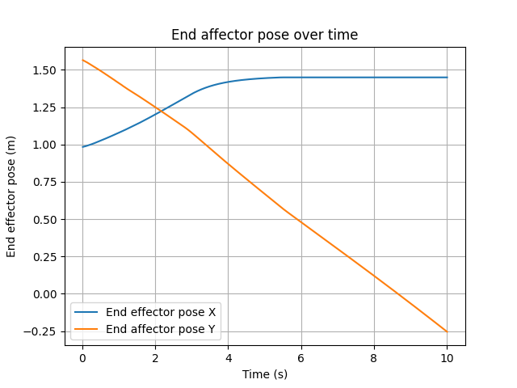 |  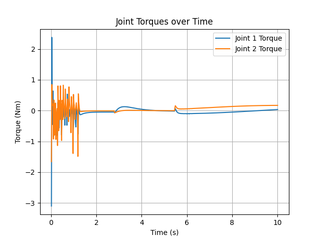 |

#### Reference videos
* LQR tracking https://www.youtube.com/watch?v=X3Dfy8H4Inc
* Mujoco world model https://www.youtube.com/watch?v=j1nCeqtfySQ
* LQR regulator around a static equilibrium point (including numerical perturbation method of linearistion) https://www.youtube.com/watch?v=KvNmOMk8pYs&list=PLc7bpbeTIk75dgBVd07z6_uKN1KQkwFRK&index=27
* Taylor series linearisation https://www.youtube.com/watch?v=owv_2YdO8rA

#### Special thanks
* Prof. Pranav Bhounsule's Mujoco lecture series on youtube
* My girlfriend for all the no travel weekends
